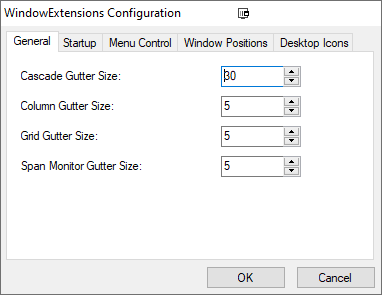
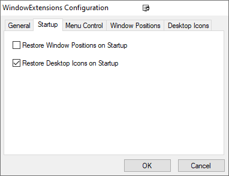
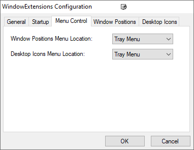

# Window Extensions

AutoHotKey Window Menu and Extensions for fine grained control of positioning

## Basic Usage:

To invoke:

- Right click the right half of any Window Caption bar
- Press `Win-W`

Brings up the main menu.

Selecting any of the entries applies to the target window, shown at the top of the menu.

> Except: `Save / Restore Window Positions` and `Save / Restore Desktop Icons`

A Configuration dialog, available from the tray icon, allows controlling some aspects of the functionality.

## Features

### Optimum Positioning

Window Extensions has menu options dedicated to Optimum positioning.

There are 5 or so menu items that position windows with increasing indentation. (Configurable)

### Window Control

There are other options for controlling window positioning, eg:

- Dedicated positions (Corners, columns, etc.)
- Centring
- Controlling transparency
- Rolling up to just a title bar
- Spanning multiple monitors if more than 1 monitor is available

### Window Positions

Window Extensions has the ability to save window positions and restore them on demand.

This was originally intended as a remedy to the widely known Multi-Monitor bug in Windows that doesn't restore window positions when unlocking or activating /  deactivating monitors.

Window positions are saved to a file in the Users data folder (E.g. %APPDATA%\WindowExtensions)

### Desktop Icons

Window Extensions has the ability to save desktop icon positions and restore them on demand.

There are other tools available which are dedicated to this task, with perhaps more functionality. This feature was added to Window Extensions due to restrictions in being able to use these tools on some sites that I visit.

Desktop Icon positions are saved to a file in the Users data folder (E.g. %APPDATA%\WindowExtensions)

## [To Do](Docs/todo.md)
